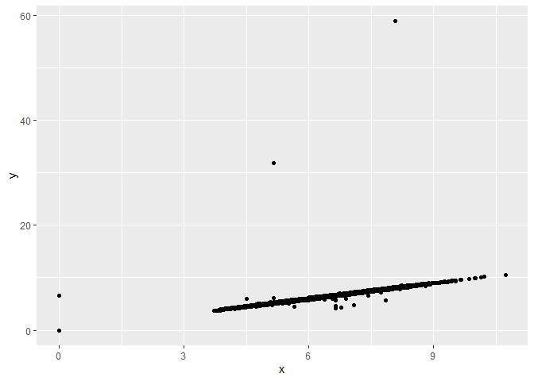
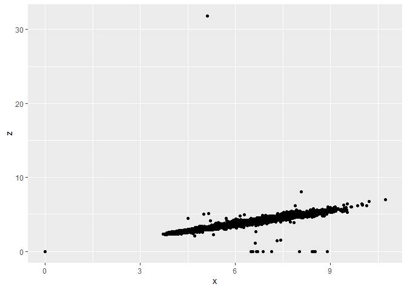
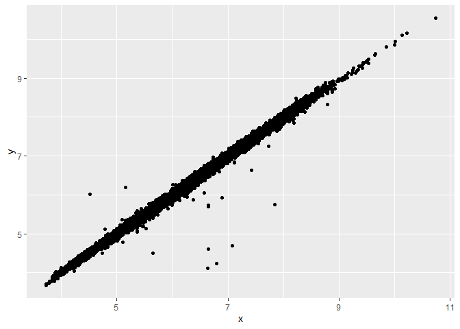
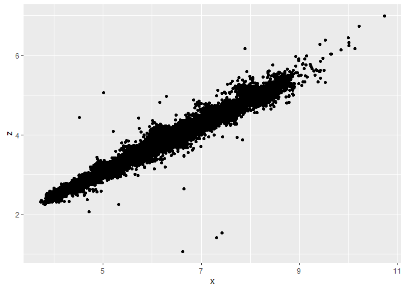

Hw\_5 Assignment
================

## Count\_cut

``` r
####
## script for homework5: data wrangling
library(tidyverse)
count_cut<- diamonds %>% 
  group_by(cut) %>%
  summarise(count = n())
```

## Sampling for 1% fraction

``` r
#sampling for 1% fraction
sample_diamond <- sample_frac(diamonds, 0.01)
```

## Largest\_diamonds mean

``` r
# largest_diamonds only
largest_diamond <- diamonds %>%
  group_by(clarity) %>%
  slice_max(order_by = carat, n = 100, with_ties = FALSE) %>%
  summarise(mean_size = mean(carat))
```

## Scatter plots

``` r
#Scatter plots
#plots of x and y

ggplot(data = diamonds) +
  geom_point(mapping = aes(x = x, y = y))
```

<!-- -->

``` r
#plots of x and z
ggplot(data = diamonds) +
  geom_point(mapping = aes(x = x, y = z))
```

<!-- -->

## Filtering strange datapoints

``` r
# filter strange datapoints

diamonds_filter <- diamonds %>% # diamond_filter is the new data_frame
  filter(x>=3) %>%
  filter(z>1 & z<30) %>%
  filter(y>1 & y<30)
# Plot of x and y
ggplot(data = diamonds_filter) +
  geom_point(mapping = aes(x = x, y = y))
```

<!-- -->

``` r
# Plot of x and z
ggplot(data = diamonds_filter) +
  geom_point(mapping = aes(x = x, y = z))
```

<!-- -->
