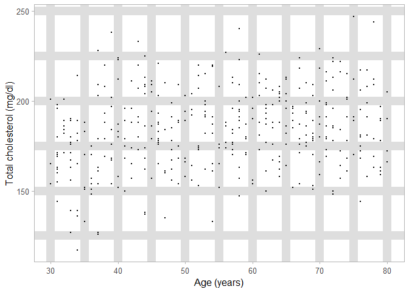
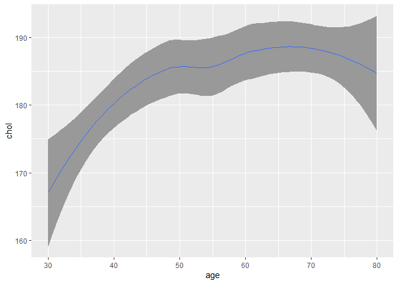
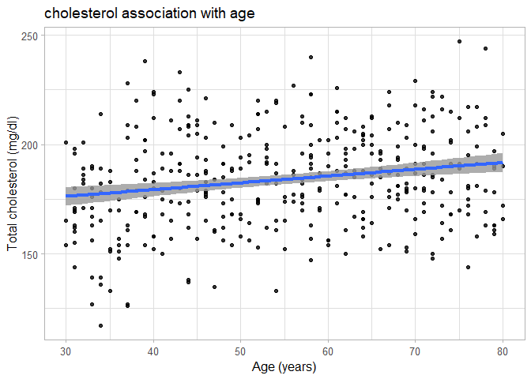

Hw7 Assignment
================

**To show if cholesterol is associated with age**

Using badplot to show the association

**Badplots**

``` r
##  Demonstrating Badplot A
library(tidyverse)
load("~/R/MICR_475/cholesterol.rda")
p = ggplot(cholesterol)
p = p + geom_point(aes(x = age, y = chol), size = 0.1)
p = p + labs (x = "Age (years)", y = "Total cholesterol (mg/dl)")
p = p + theme_light(base_size = 12)
p = p + theme(panel.grid.minor = element_line(size = 5.0), panel.grid.major = element_line(size = 5.0))
print(p)
```

<!-- -->

``` r
### Demonstrating Badplot B

q = ggplot(cholesterol)
q = q + geom_smooth(aes(x = age, y = chol), alpha = 1.0, size = 0.1)
print(q)
```

<!-- -->

**why are both Badplots to show the association between cholesterol and
age?** One of the principles of Tufte is to choose a precise data/ink
ratio for visualization of a data. This would allow the data to show
through and minimize any visual clutter.The datapoint is very small, and
the grid lines are big, thus reducing the ability to comprehend the
information in the data.(Tufte. ch: Data ink maximzation: pg 126). The
plot does not answer how we are showing the association between both
variables. The second plot lacks the Tufte principle of graphical
excellence because we can not see what the underlying data look like
because it is just a line that is showing the relationship. Also, the
plot is not optimal because we did not specify the type of models to
show the association(Tufte. ch: Principle of graphical excellence,
pg:15).

**The good plot**

``` r
p = ggplot(cholesterol)
p = p + geom_point(aes(x = age, y = chol), alpha = 0.8, size = 1.5)
p = p + geom_smooth(aes(x = age, y = chol), method = "lm", alpha = 0.8, size = 1.5)
p = p + labs (x = "Age (years)", y = "Total cholesterol (mg/dl)", title = "cholesterol association with age") 
p = p + theme_light(base_size = 12)
print(p)
```

    ## `geom_smooth()` using formula 'y ~ x'

<!-- -->
