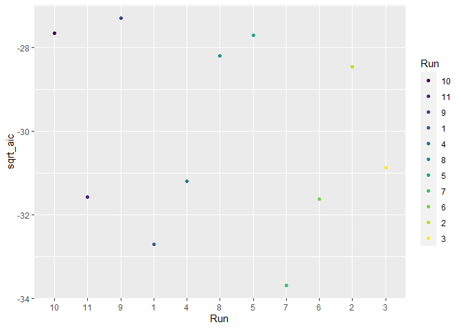
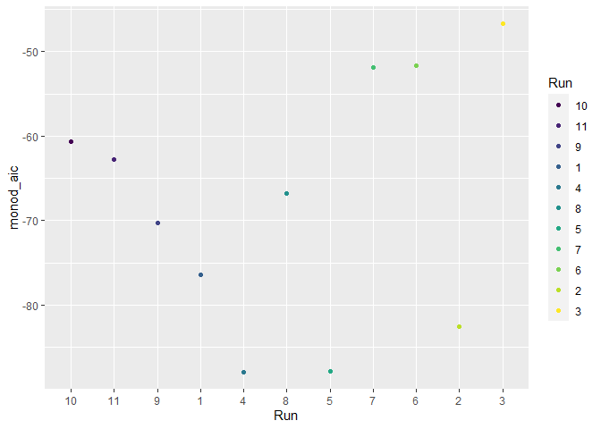
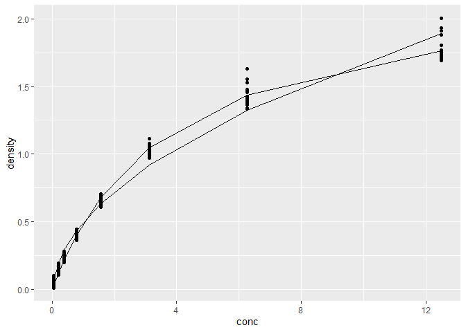

Hw\_8 Assignment
================

``` r
library(modelr)
library(tidyverse)
library(broom)
# make a dataframe  slope relationship of price as a function of weight(carat) for each unique color
by_color <- diamonds %>%
  group_by(color)%>%
  nest()

price_by_carat <- function(df){
  m <- lm(price~carat, data = df)
}
# Computing the function for each price by carat
by_color <- by_color %>%
  mutate(fit= map(data, price_by_carat))


# getting the slope for the regression
get_slope <- function(fit_obj) {
  slope <- coef(fit_obj)[2]
  slope
}
# computing the slope function for eahc price by carat
by_color <- by_color %>%
  mutate(slope = map_dbl(fit, get_slope))

## arrange slope  in increasing order
  
by_color %>%
  arrange(slope)
```

    ## # A tibble: 7 x 4
    ## # Groups:   color [7]
    ##   color data                  fit    slope
    ##   <ord> <list>                <list> <dbl>
    ## 1 J     <tibble [2,808 x 9]>  <lm>   7094.
    ## 2 H     <tibble [8,304 x 9]>  <lm>   7619.
    ## 3 I     <tibble [5,422 x 9]>  <lm>   7761.
    ## 4 E     <tibble [9,797 x 9]>  <lm>   8296.
    ## 5 D     <tibble [6,775 x 9]>  <lm>   8408.
    ## 6 G     <tibble [11,292 x 9]> <lm>   8525.
    ## 7 F     <tibble [9,542 x 9]>  <lm>   8677.

**Question 2**

``` r
library(nls2)
by_runs <- DNase %>%
  group_by (Run )
nls_mod <- formula(density ~ beta_1 * sqrt(conc) + beta_0)


single_sqrt_model <- nls2(nls_mod, 
                          data = by_runs, 
                          start = list(beta_1 = 0.5, beta_0 = 0.1))

summary(single_sqrt_model)
```

    ## 
    ## Formula: density ~ beta_1 * sqrt(conc) + beta_0
    ## 
    ## Parameters:
    ##         Estimate Std. Error t value Pr(>|t|)    
    ## beta_1  0.550521   0.006287   87.57  < 2e-16 ***
    ## beta_0 -0.053297   0.011081   -4.81 3.26e-06 ***
    ## ---
    ## Signif. codes:  0 '***' 0.001 '**' 0.01 '*' 0.05 '.' 0.1 ' ' 1
    ## 
    ## Residual standard error: 0.08897 on 174 degrees of freedom
    ## 
    ## Number of iterations to convergence: 1 
    ## Achieved convergence tolerance: 6.129e-08

``` r
# using the  monod  model
nls_mod2 <- formula(density ~ conc * dmax / (conc + k))


monod_model <- nls2(nls_mod2,
                    data = by_runs,
                    start = list(dmax = 2.5, k = 1.25))
summary(monod_model)
```

    ## 
    ## Formula: density ~ conc * dmax/(conc + k)
    ## 
    ## Parameters:
    ##      Estimate Std. Error t value Pr(>|t|)    
    ## dmax  2.28032    0.02189  104.16   <2e-16 ***
    ## k     3.68241    0.08677   42.44   <2e-16 ***
    ## ---
    ## Signif. codes:  0 '***' 0.001 '**' 0.01 '*' 0.05 '.' 0.1 ' ' 1
    ## 
    ## Residual standard error: 0.04909 on 174 degrees of freedom
    ## 
    ## Number of iterations to convergence: 6 
    ## Achieved convergence tolerance: 1.769e-06

``` r
# Make a dataframe of list of columns for the two models

by_run_model <- by_runs %>%
  nest() %>%
  mutate(
    sqrt_mod = map(data, ~nls2(
      nls_mod,
      data = .,
      start =list(beta_1 = 0.5, beta_0 = 0.1)
      )),
    
    monod_mod = map(data, ~nls2(
      nls_mod2,
      data = .,
      start = list(dmax = 2.5, k = 1.25)
    )),
    sqrt_aic = map_dbl(sqrt_mod, ~glance(.)$AIC),
    monod_aic = map_dbl(monod_mod, ~glance(.)$AIC)
  )

# plotting each run for single sqrt model
ggplot(by_run_model)+
  geom_point(aes(x = Run, y = sqrt_aic, color = Run))
```

<!-- -->

``` r
# plotting each run  for monod_model
ggplot(by_run_model)+
 geom_point(aes(x = Run, y = monod_aic, color = Run))
```

<!-- -->

``` r
#Predicting models  

model <-data_frame( x = predict(single_sqrt_model), y = predict(monod_model))
  

predict_model <- cbind.data.frame(by_runs, model)


ggplot(predict_model, aes(conc, density)) +
  geom_point() +
  geom_line(aes(conc, x))+
  geom_line(aes(conc, y))
```

<!-- -->
