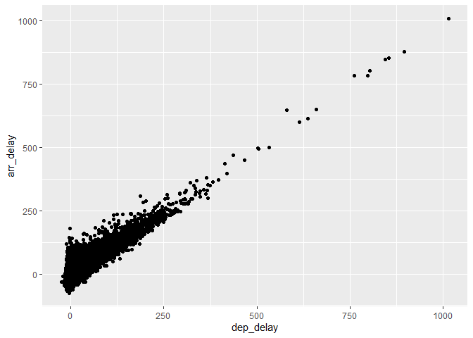

HW\_4 Notebook
================

``` r
####
## script for Homework4, sum and scatterplot 
#####
library(tidyverse)
```

    ## -- Attaching packages --------------------------------------- tidyverse 1.3.0 --

    ## v ggplot2 3.3.3     v purrr   0.3.4
    ## v tibble  3.0.6     v dplyr   1.0.3
    ## v tidyr   1.1.2     v stringr 1.4.0
    ## v readr   1.4.0     v forcats 0.5.1

    ## -- Conflicts ------------------------------------------ tidyverse_conflicts() --
    ## x dplyr::filter() masks stats::filter()
    ## x dplyr::lag()    masks stats::lag()

``` r
library(nycflights13)
```

    ## Warning: package 'nycflights13' was built under R version 4.0.5

``` r
a <- 3
b <- 2
# The sum of a and b
print(a+b)
```

    ## [1] 5

``` r
# Using the sum function 
sum(2+3)
```

    ## [1] 5

``` r
head(flights)
```

    ## # A tibble: 6 x 19
    ##    year month   day dep_time sched_dep_time dep_delay arr_time sched_arr_time
    ##   <int> <int> <int>    <int>          <int>     <dbl>    <int>          <int>
    ## 1  2013     1     1      517            515         2      830            819
    ## 2  2013     1     1      533            529         4      850            830
    ## 3  2013     1     1      542            540         2      923            850
    ## 4  2013     1     1      544            545        -1     1004           1022
    ## 5  2013     1     1      554            600        -6      812            837
    ## 6  2013     1     1      554            558        -4      740            728
    ## # ... with 11 more variables: arr_delay <dbl>, carrier <chr>, flight <int>,
    ## #   tailnum <chr>, origin <chr>, dest <chr>, air_time <dbl>, distance <dbl>,
    ## #   hour <dbl>, minute <dbl>, time_hour <dttm>

``` r
#filter AA carrier and convert to data frame
aa_flights <- filter(flights, carrier == "AA")
aa_flights <- as.data.frame(aa_flights)
ggplot(data = aa_flights) +
  geom_point(mapping = aes(x = dep_delay, y = arr_delay)) # relationship between delay and arriver
```

    ## Warning: Removed 782 rows containing missing values (geom_point).

<!-- -->
